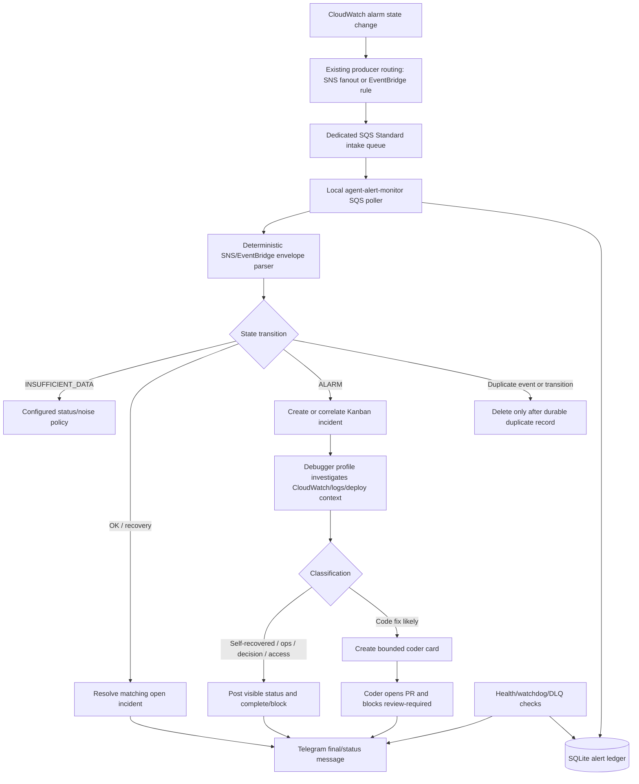
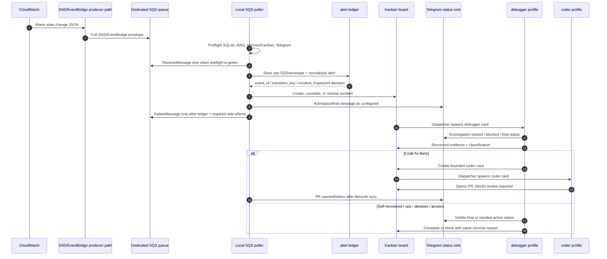
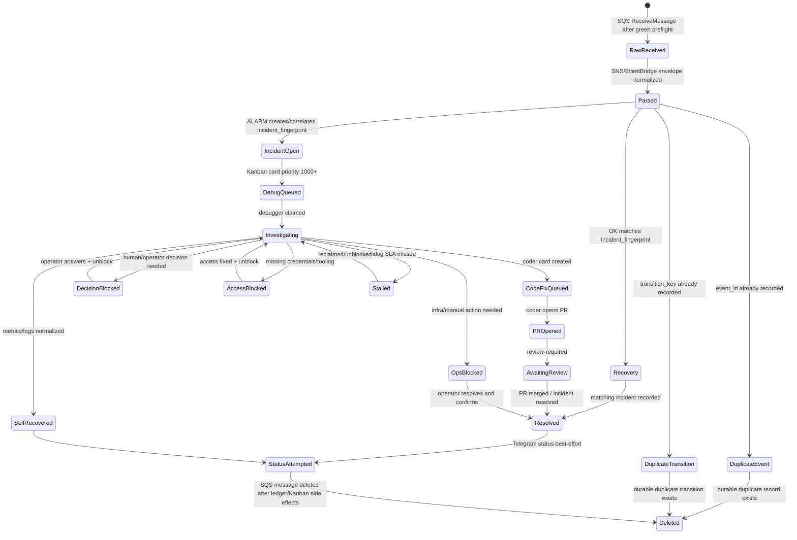

# Agent Alert Monitor

Local SQS-to-Hermes Kanban incident coordinator for configured cloud alert queues, with Telegram retained as a human-visible status sink.

This project consumes CloudWatch/SNS/EventBridge alert payloads from a dedicated SQS queue, records every alert in a local SQLite ledger, correlates related alerts per configured project, plans or creates high-priority Kanban incident cards, and emits concise Telegram status messages so failures do not disappear silently. Telegram intake remains available only as a legacy/fallback manual path; SQS is the target source of truth for durable alert intake.

Version: `0.1.0`.
License: MIT.

## Architecture

```text
CloudWatch alarm state changes
  → SNS/EventBridge envelope in existing dedicated SQS queue
  → local SQS poller / DLQ inspector
  → alert coordinator profile/session
  → durable alert ledger
  → high-priority Kanban incident cards
  → debugger profile investigates
  → coder PR card only when code fix is likely
  → concise Telegram status messages posted back to alert channel
```

Core principle:

```text
SQS queue = cloud-durable alert intake boundary
Telegram session = human-visible status mirror and legacy/fallback manual intake
Alert ledger = durable local dedupe/recovery state
Kanban = execution state and multi-agent fan-out
Watchdog = no-silence guarantee
```

### High-level flow



### Sequence: new SQS alert → debugger → resolution



### Incident state machine



## What is implemented in v0.1.0

- Python package with CLI entry point `agent-alert-monitor`.
- SQS commands for configured `aws_sqs` sources: sanitized `sqs-peek`, `sqs-ingest --dry-run`, live `sqs-listen`, `health --source ... --json`, and `dlq-inspect --source ...` output.
- YAML/env configuration loader with multiple SQS sources, Telegram status sinks, Hermes/Kanban routing, and secret-free examples.
- SQLite ledger for raw SQS messages, normalized alerts, deterministic event/transition idempotency, incident correlation, PR lifecycle references, and watchdog state.
- SNS and EventBridge CloudWatch alarm parsers with stable `event_id`, `transition_key`, and `incident_fingerprint` values.
- Dry-run synthetic/manual alert flow that produces the planned Kanban card and channel message with zero Telegram/provider/Kanban side effects.
- Telegram `getUpdates` poll-once helper retained only for legacy/fallback manual intake.
- Standard concise Telegram message templates.
- Watchdog evaluation for stalled incidents.
- systemd user unit examples for intake and watchdog.
- Public docs for architecture, operations, message templates, and Kanban flow.

## Prerequisites

- Linux host with Python 3.11+.
- Hermes CLI installed and configured on the same host that will run this package. See the Hermes install guide: <https://hermes-agent.nousresearch.com/docs/getting-started/installation>.
- Hermes Kanban enabled and initialized, with the board slugs and worker profiles named in `config.yaml` already created. See the Kanban guide: <https://hermes-agent.nousresearch.com/docs/user-guide/features/kanban>.
- Existing dedicated SQS Standard queue and DLQ for alert intake, with queue URL/DLQ URL supplied in local environment variables.
- Narrow AWS credentials with `sts:GetCallerIdentity`, `sqs:GetQueueAttributes`, `sqs:ReceiveMessage` for inspection/dry-run, and `sqs:DeleteMessage`/`sqs:ChangeMessageVisibility` for live `sqs-listen` consumption.
- Telegram status bot token per monitored project. Each status bot must be able to post/read its configured status channel; Telegram intake is legacy/fallback only for SQS-first projects.
- Optional cloud/provider CLIs configured readonly if debugger workers will inspect logs, metrics, deploys, or traces.
- Optional: `gh` for release/tag workflows if you use GitHub.

## Hermes and Kanban live-mode prerequisite setup

`scripts/install.sh` installs only this Python package into `.venv`; it does not install or configure Hermes. For the clone → install → dry-run evaluation path, you can skip this section temporarily and use the local dry-run commands below. Live `ingest`/`listen` shells out to the local `hermes` CLI to create Kanban incident cards, so complete these prerequisites before you disable `--dry-run`.

Generic setup path:

1. Install Hermes CLI on the host:

   ```bash
   curl -fsSLO https://hermes-agent.nousresearch.com/install.sh
   less install.sh          # inspect the installer, or follow the official guide above
   bash install.sh
   export PATH="$HOME/.local/bin:$PATH"  # or open a new shell after install
   hermes setup --portal   # or run hermes setup and choose your provider/model
   hermes doctor
   ```

2. Create or configure the coordinator and worker profiles that your `config.yaml` will reference. Profiles are isolated Hermes homes; see <https://hermes-agent.nousresearch.com/docs/user-guide/profiles>.

   ```bash
   hermes profile create alert-coordinator --description "Routes alert monitor incidents into Kanban."
   hermes profile create debugger --description "Investigates alert incidents and posts status."
   hermes profile create worker-alert-coordinator --description "Routes worker alert incidents into Kanban."
   hermes profile create worker-debugger --description "Investigates worker alert incidents."
   hermes -p alert-coordinator setup
   hermes -p debugger setup
   hermes -p worker-alert-coordinator setup
   hermes -p worker-debugger setup
   ```

   The four profile names above match the stock `config.example.yaml`. If you rename profiles, update `projects[].hermes.coordinator_profile` and `projects[].kanban.incident_assignee` to the same names.

3. Initialize Kanban and create the board slugs from `config.yaml`:

   ```bash
   hermes -p alert-coordinator kanban init
   hermes -p alert-coordinator kanban boards create sample-api-incidents --name "Sample API incidents"
   hermes -p worker-alert-coordinator kanban init
   hermes -p worker-alert-coordinator kanban boards create worker-incidents --name "Worker incidents"
   hermes -p alert-coordinator kanban boards list
   hermes -p worker-alert-coordinator kanban boards list
   hermes -p alert-coordinator gateway install   # one-time service install; use `hermes -p alert-coordinator gateway run` instead for foreground mode
   hermes -p alert-coordinator gateway start
   hermes -p alert-coordinator gateway status
   hermes -p worker-alert-coordinator gateway install
   hermes -p worker-alert-coordinator gateway start
   hermes -p worker-alert-coordinator gateway status
   hermes -p alert-coordinator kanban --board sample-api-incidents create \
     "smoke test incident" --assignee debugger --body "Verify dispatcher/profile wiring."
   ```

   The final command should create a task on the named board without errors. Repeat the smoke-test create under `worker-alert-coordinator` for `worker-incidents` if you keep the stock worker project enabled. `hermes -p <coordinator-profile> gateway status` should show a running gateway/dispatcher before you rely on automatic worker pickup for that profile.

4. Then clone/install this package and run `./scripts/setup-interactive.sh`. Use the manual `config.example.yaml` copy path only if you are not using the wizard; the wizard intentionally refuses to overwrite an existing `config.yaml` unless you pass `--force`. Only switch to live mode after every project has passed a synthetic dry-run and the Kanban board smoke test above.

## Install locally

```bash
git clone https://github.com/dannyfranca/agent-alert-monitor.git agent-alert-monitor
cd agent-alert-monitor
./scripts/install.sh
./scripts/setup-interactive.sh
```

The installer pre-creates `./state` with mode `0700`; keep that restrictive mode because the ledger contains production alert metadata. The interactive setup writes `config.yaml` and `.env` locally, with `.env` mode `0600` because it contains secrets.

Edit `config.yaml` and `.env` locally if you need to adjust generated values. Do not commit either file.

## Interactive setup wizard

Run the guided setup from the repo root:

```bash
./scripts/setup-interactive.sh
```

Useful flags:

```bash
./scripts/setup-interactive.sh --skip-live-checks  # write files without Telegram/Hermes validation
./scripts/setup-interactive.sh --force             # intentionally replace existing config.yaml/.env
agent-alert-monitor setup --root .                 # same wizard after activating .venv
```

The wizard asks for and explains how to get:

- Telegram listener bot token: create a dedicated bot with `@BotFather` using `/newbot`.
- Telegram alert channel id: add the listener bot as a channel admin, post a test alert, then run the wizard's env-based `getUpdates`/cleanup snippets and copy `chat.id` without pasting the token into chat, browser history, or shell history.
- Hermes coordinator profile: create/configure with `hermes profile create <name>` and `hermes -p <name> setup`.
- Hermes Kanban board slug: create/list with `hermes -p <coordinator-profile> kanban boards create <slug>` and `hermes -p <coordinator-profile> kanban boards list`.
- Incident assignee/debugger profile: create/configure with `hermes profile create <name>` and `hermes -p <name> setup`.
- Optional AWS credentials: if you answer yes, the wizard prompts locally for AWS profile, region, access key id, and secret access key; writes `~/.aws`-style files with restrictive permissions; and validates STS, CloudWatch, and CloudWatch Logs access. The standalone `./scripts/setup-aws-readonly.sh` remains available if you prefer to configure AWS separately. For live SQS, add queue consumer permissions to that profile before enabling `sqs-listen`.

As it goes, live mode validates what it can without committing side effects:

- Telegram token via `getMe`.
- Telegram channel access via `getChat`.
- Hermes CLI presence.
- Coordinator profile visibility via `hermes profile list`.
- Kanban board visibility via `hermes -p <profile> kanban boards list`.

The wizard does not paste secrets into the terminal output. It stores entered tokens only in local `.env`.


## Multi-project configuration

`config.yaml` uses a top-level `projects:` list so one install can monitor multiple independent channels. Each entry controls:

- `slug`, `display_name`, and `environment` for project identity and card titles.
- `sources[]` for SQS queue URL/ARN env vars, DLQ URL/ARN env vars, AWS region, envelope type, polling limits, and delete policy.
- `sinks[]` for Telegram status output. Telegram is not the durable source for SQS-first projects.
- `hermes.coordinator_profile`, `hermes.kanban_board`, and `hermes.channel_target` for local Hermes routing.
- `kanban.tenant`, `kanban.incident_assignee`, and priorities for generated incident cards.
- `messages.prefix` for visible channel status/final messages.

Example projects in `config.example.yaml`:

- `sample-api`: SQS CloudWatch alert source routed to `sample-api-incidents`, `debugger`, and a Telegram status sink.
- `worker-queue`: legacy/manual Telegram fallback example routed to `worker-incidents` and `worker-debugger`.

Use `--source <source-name>` for SQS health, DLQ inspection, dry-run parsing, and live listening. Use `--project <slug>` only for synthetic/manual fallback commands or legacy Telegram polling. Omit `--project` for legacy `ingest`/`listen` to process all configured fallback projects.

Minimal local smoke test:

```bash
source .venv/bin/activate
set -a; . ./.env; set +a
agent-alert-monitor --config config.yaml --project sample-api synthetic-alert \
  --message-id synthetic-1 \
  --text 'CRITICAL ALARM: Service5xx service=api region=us-east-1' \
  --dry-run
```

The output is JSON. It should include:

- `action: would_create_incident`
- `external_side_effects: false`
- a planned Kanban card assigned to the selected project's debugger profile
- a concise project-prefixed `🔎 ... alert monitor` channel message

## Telegram status sink and legacy fallback setup

SQS-first projects use Telegram as a human-visible status/final-message sink. Telegram `getUpdates` intake is retained only as a legacy/manual fallback path after SQS live mode is stable.

1. Create a dedicated Telegram status bot.
   - If you also keep legacy fallback polling, do not reuse a bot that posts the source alerts; Telegram does not deliver a bot's own channel posts through `getUpdates`.
   - Reuse is only safe when fallback channel alerts are posted by another actor, such as a human account or a different bot.
2. Add it to the existing application alert/status channel as an admin.
3. Put each token and chat id in local environment only, using the env vars named by that project's sink, such as `ALERT_MONITOR_SAMPLE_API_TELEGRAM_BOT_TOKEN=...` and `ALERT_MONITOR_SAMPLE_API_TELEGRAM_CHAT_ID=...`.
4. If you temporarily use legacy Telegram polling, clear any existing webhook first. For the first non-dry fallback run after dry-run testing, intentionally drop stale pending updates for each project bot so old channel posts are not replayed into real Kanban/status side effects:

   ```bash
   python - <<'PY'
   from urllib.parse import urlencode
   from urllib.request import urlopen
   import json, os

   token_envs = [
       "ALERT_MONITOR_SAMPLE_API_TELEGRAM_BOT_TOKEN",
       "ALERT_MONITOR_WORKER_QUEUE_TELEGRAM_BOT_TOKEN",
   ]
   for token_env in token_envs:
       token = os.environ[token_env]
       base = f"https://api.telegram.org/bot{token}"
       print(f"# {token_env}")
       for path, query in [
           ("deleteWebhook", {"drop_pending_updates": "true"}),
           ("getWebhookInfo", {}),
       ]:
           url = f"{base}/{path}"
           if query:
               url = f"{url}?{urlencode(query)}"
           print(json.dumps(json.load(urlopen(url, timeout=15)), indent=2))
   PY
   ```

   `getWebhookInfo` should report an empty `url`; otherwise Telegram will reject `getUpdates` polling with a webhook conflict.
5. For every SQS-first `projects[]` entry, set `sinks[].chat_id_env`, `hermes.channel_target`, `hermes.kanban_board`, `kanban.tenant`, `kanban.incident_assignee`, and `messages.prefix` in `config.yaml`. Use Hermes board slugs such as `sample-api-incidents`, not SQLite database paths. For legacy fallback projects, also set `telegram.alert_chat_id` and `telegram.offset_path`.
6. Run an SQS health check and `sqs-ingest --dry-run` for each SQS source before enabling `sqs-listen`.
7. If you cannot drop pending Telegram updates because you need the legacy fallback backlog for investigation, prime each project's offset intentionally before fallback live mode: page through `getUpdates` until no pending updates remain, inspect every returned page, and write the configured `telegram.offset_path` in the agent's expected JSON format, for example `{ "offset": 12346 }`, where the value is one greater than the highest inspected `update_id`. Only start non-dry legacy `listen` after every fallback project offset file is in place.

This design uses local polling/listening. It does not require public webhooks, ngrok, reverse SSH tunnels, or inbound router/NAT changes.

## Hermes profile assumptions

Recommended profile split per project:

- `alert-coordinator` or a project-specific coordinator profile: owns correlation, ledger updates, Kanban fan-out, and channel status text.
- `debugger`: first responder for log/metric/deploy investigation.
- `coder`: opens code-fix PRs only when the debugger classifies the incident as code-fix-likely.
- `reviewer`: reviews code/product fit before merge.

The local poller can create Kanban cards through the Hermes CLI in non-dry mode. Before enabling live mode, verify every configured coordinator profile exists and can create cards on its configured board slug. Agent workers should still prefer native Kanban tools when already running inside Hermes.

## AWS queue consumer and diagnostic credentials

The local agent needs two permission groups:

- Queue consumer permissions on the dedicated intake queue/DLQ. These are narrowly scoped, but live mode is not read-only because it must delete successfully processed SQS messages.
- Diagnostic read permissions for debugger workers to inspect CloudWatch alarms, metrics, and logs.

The setup wizard can collect AWS credentials directly:

```bash
./scripts/setup-interactive.sh
```

When prompted for AWS setup, provide:

- AWS config directory, usually `~/.aws`
- AWS profile name: on a fresh dedicated assistant VM the wizard suggests `default` so Hermes workers can read CloudWatch credentials without extra environment propagation; if an existing default profile is present, it suggests `alert-monitor-readonly` instead.
- AWS region, for TicketDoVale usually `sa-east-1`
- AWS access key id for a dedicated IAM user
- AWS secret access key for that same IAM user, entered hidden

Use this credential type:

- Dedicated IAM user access key pair: `AWS_ACCESS_KEY_ID` + `AWS_SECRET_ACCESS_KEY`
- No AWS root account keys
- No console password needed
- No AWS SSO/role profile for the wizard path; the wizard intentionally writes static profile credentials and clears stale session-token/role/SSO fields for that profile.

Minimum IAM policy shape for SQS intake plus CloudWatch/Logs debugging:

```json
{
  "Version": "2012-10-17",
  "Statement": [
    {
      "Sid": "IdentityCheck",
      "Effect": "Allow",
      "Action": "sts:GetCallerIdentity",
      "Resource": "*"
    },
    {
      "Sid": "ConsumeAgentAlertQueue",
      "Effect": "Allow",
      "Action": [
        "sqs:GetQueueAttributes",
        "sqs:GetQueueUrl",
        "sqs:ReceiveMessage",
        "sqs:DeleteMessage",
        "sqs:ChangeMessageVisibility"
      ],
      "Resource": "arn:aws:sqs:<region>:<account-id>:agent-alert-monitor-ticketdovale-prod"
    },
    {
      "Sid": "InspectAgentAlertDlq",
      "Effect": "Allow",
      "Action": [
        "sqs:GetQueueAttributes",
        "sqs:ReceiveMessage"
      ],
      "Resource": "arn:aws:sqs:<region>:<account-id>:agent-alert-monitor-ticketdovale-prod-dlq"
    },
    {
      "Sid": "CloudWatchReadOnly",
      "Effect": "Allow",
      "Action": [
        "cloudwatch:DescribeAlarms",
        "cloudwatch:DescribeAlarmHistory",
        "cloudwatch:GetMetricData",
        "cloudwatch:GetMetricStatistics",
        "cloudwatch:ListMetrics"
      ],
      "Resource": "*"
    },
    {
      "Sid": "CloudWatchLogsReadOnly",
      "Effect": "Allow",
      "Action": [
        "logs:DescribeLogGroups",
        "logs:DescribeLogStreams",
        "logs:FilterLogEvents",
        "logs:GetLogEvents",
        "logs:StartQuery",
        "logs:GetQueryResults",
        "logs:StopQuery"
      ],
      "Resource": "*"
    }
  ]
}
```

Routine DLQ inspection does not need redrive permissions. Grant redrive/replay permissions only to an operator role used for recovery.

The wizard validates only:

- `aws sts get-caller-identity`
- `aws cloudwatch describe-alarms`
- `aws logs describe-log-groups`

The SQS health command validates queue and DLQ access after `config.yaml` and queue env vars are in place:

```bash
agent-alert-monitor --config config.yaml health --source ticketdovale-prod-alerts --json
```

The wizard writes `credentials` and `config` with `0600`, exports `AWS_PROFILE`, `AWS_REGION`, `AWS_DEFAULT_REGION`, `AWS_SHARED_CREDENTIALS_FILE`, and `AWS_CONFIG_FILE` into local `.env`, then validates STS, CloudWatch, and CloudWatch Logs. The standalone helper script is also available:

```bash
./scripts/setup-aws-readonly.sh
```

Do not commit cloud/provider credentials or profile files.

## systemd user services

Install example units for the current user:

```bash
./scripts/systemd-install.sh
systemctl --user edit agent-alert-monitor-sqs-readiness.service
systemctl --user edit agent-alert-monitor-health.service
systemctl --user daemon-reload
SYSTEMD_ENV="$(systemctl --user show agent-alert-monitor-health.service --property=Environment --value)"
SYSTEMD_WORKDIR="$(systemctl --user show agent-alert-monitor-health.service --property=WorkingDirectory --value)"
printf "%s\n" "$SYSTEMD_ENV" | tr " " "\n" | grep "^PATH="
systemd-run --user --wait --collect --pty \
  --property=WorkingDirectory="${SYSTEMD_WORKDIR:-$PWD}" \
  --property=Environment="$SYSTEMD_ENV" \
  /usr/bin/env sh -lc 'command -v hermes && hermes --version'
systemctl --user enable --now agent-alert-monitor-sqs-readiness.service agent-alert-monitor-health.timer agent-alert-monitor-watchdog.timer
```

The install script substitutes the current repo path into the unit files. Run it from the clone path you intend to operate. On headless VMs, ensure the user manager survives logout with `loginctl enable-linger <user>` if that is not already configured.

The bundled units persist a service PATH of `%h/.local/bin:/usr/local/bin:/usr/bin:/bin` so non-dry live card creation can resolve a standard `hermes` install even when the user manager did not inherit your shell PATH. If `hermes` is installed somewhere else, add a user-service override that sets `Environment=PATH=...` before enabling live mode.

Smoke-test the installed user service's resolved environment before enabling live mode. This reads the `Environment=` and `WorkingDirectory=` values from `agent-alert-monitor-health.service`, so user-service overrides for a custom Hermes install are included in the check:

```bash
systemctl --user daemon-reload
SYSTEMD_ENV="$(systemctl --user show agent-alert-monitor-health.service --property=Environment --value)"
SYSTEMD_WORKDIR="$(systemctl --user show agent-alert-monitor-health.service --property=WorkingDirectory --value)"
printf "%s\n" "$SYSTEMD_ENV" | tr " " "\n" | grep "^PATH="
systemd-run --user --wait --collect --pty \
  --property=WorkingDirectory="${SYSTEMD_WORKDIR:-$PWD}" \
  --property=Environment="$SYSTEMD_ENV" \
  /usr/bin/env sh -lc 'command -v hermes && hermes --version'
```

The `grep "^PATH="` line should print the PATH resolved from the installed user service, and the `command -v hermes` line should print the Hermes binary path before you rely on SQS health/readiness or `watchdog-due --send-telegram`. If you installed Hermes outside that PATH, update the service override with `systemctl --user edit agent-alert-monitor-health.service`, reload the user manager, and re-run this smoke test.

## Common commands

```bash
# Tests
python -m pytest -q

# Lint if ruff is installed
python -m ruff check .

# SQS health, dry-run parsing, DLQ inspection, and live consumption
agent-alert-monitor --config config.yaml health --source sample-api-prod-alerts --json
agent-alert-monitor --config config.yaml sqs-peek --source sample-api-prod-alerts --max-messages 10
agent-alert-monitor --config config.yaml sqs-ingest --source sample-api-prod-alerts --dry-run
agent-alert-monitor --config config.yaml dlq-inspect --source sample-api-prod-alerts --max-messages 10
agent-alert-monitor --config config.yaml sqs-listen --source sample-api-prod-alerts --once

# Legacy/manual Telegram dry-run synthetic alert
agent-alert-monitor --config config.yaml --project sample-api synthetic-alert --text 'ALARM: Service5xx service=api' --dry-run

# Legacy Telegram fallback polling without creating cards
agent-alert-monitor --config config.yaml ingest --dry-run  # all configured fallback projects
agent-alert-monitor --config config.yaml --project worker-queue ingest --dry-run

# Print watchdog findings as JSON
agent-alert-monitor --config config.yaml watchdog-due

# Mark an incident closed only after a visible final channel status was posted
agent-alert-monitor --config config.yaml incident-update \
  --incident t_example --status resolved --last-channel-status final
```

Manual `incident-update --status done|closed|resolved` intentionally requires `--last-channel-status final` (or an already-recorded final status) so legacy/manual ledger closure cannot silently bypass the channel outcome and watchdog path. Live SQS recovery still treats Telegram status as best-effort after required ledger/Kanban side effects succeed.

## Security model

- No secrets are committed. `.env`, `config.yaml`, local state, and SQLite ledgers are ignored.
- `config.example.yaml` and `.env.example` contain placeholders only.
- Telegram tokens are read from local environment variables named by each project config.
- Cloud/provider access should be readonly and scoped to SQS inspection plus the triage surfaces debugger workers need; only live intake needs `DeleteMessage` and `ChangeMessageVisibility` on the dedicated intake queue.
- DLQ inspection output is sanitized by design: it shows message ids, parser errors, keys, and counts, not raw bodies, receipt handles, token values, or secret-looking payload values.
- Ledger data is local operational state: raw alert text, fingerprints, incident ids, status timestamps, optional PR references. Treat it as sensitive production metadata.
- Rotate or prune ledger state according to your incident retention needs. A simple first policy is to back up then delete resolved rows older than 90 days.

## Troubleshooting

- SQS source health fails: verify queue URL/ARN env vars, region, AWS profile, and `sqs:GetQueueAttributes` permissions before receiving messages.
- `sqs-ingest --dry-run` shows parse failures: confirm the configured `envelope` matches the producer path (`aws_sns_cloudwatch_alarm` vs `aws_eventbridge_cloudwatch_alarm`).
- DLQ has messages: run `dlq-inspect`, fix parser/config or producer shape, then redrive only after an operator decision.
- Telegram status missing: confirm the status bot is channel admin and the chat id matches the selected sink env var. Do not treat this as intake loss; SQS remains the source of truth.
- Token error: ensure the configured Telegram sink `bot_token_env` is exported in the same environment running the service.
- Duplicate incidents: inspect `event_id`, `transition_key`, and `incident_fingerprint` in `ledger.sqlite`; fingerprints are scoped by project and alert source.
- Silent incident: run `agent-alert-monitor --config config.yaml watchdog-due` and check whether `last_channel_post_at` is being updated.
- Kanban card not created in live SQS mode: verify Hermes CLI auth/profile can run `hermes kanban create` manually on the configured board.

## Versioning and upgrades

Use semantic versions. This project starts at `v0.1.0`. Before publishing a new release:

1. Run tests and lint.
2. Run a dry-run synthetic alert.
3. Check that examples still contain no secrets and no private/project-specific names.
4. Commit with Conventional Commits.
5. Tag and push to the already-configured remote:

```bash
git tag -a v0.1.0 -m 'v0.1.0'
git push origin v0.1.0
```

## Release checklist

From a normal clone with an already-configured remote, publish reviewed commits and then create the first release tag:

```bash
git tag -a v0.1.0 -m 'v0.1.0'
git push origin v0.1.0
```
